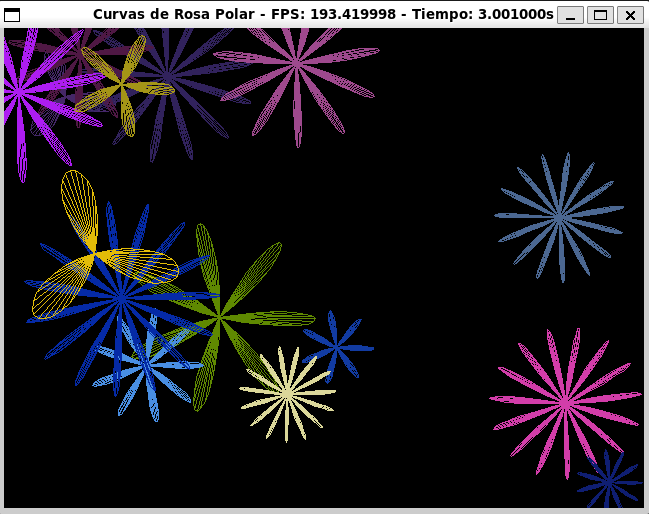

# Proyecto - Screen Saver
**Universidad del Valle de Guatemala**\
**Facultad de Ingeniería**\
**Departamento de Ciencias de la Computación**\
**Computación Paralela y Distribuida**

---

## Autores
- Diego Leiva
- Pablo Orellana

---
## Descripción
Este proyecto consiste en el desarrollo de un protector de pantalla (screen saver) que genera patrones visuales basados en las curvas polares conocidas como Rosa Polar o Curva Rhodoneas. El proyecto incluye dos versiones del algoritmo: una implementación secuencial y otra paralela, utilizando la biblioteca SDL para el renderizado gráfico y OpenMP para la paralelización.

## Objetivos
- Implementar y diseñar un programa para la paralelización de procesos con memoria compartida usando OpenMP
- Aplicar el método PCAM y los conceptos de patrones de descomposición y programación para modificar un programa secuencial y volverlo paralelo
- Realizar mejoras y modificaciones iterativas al programa para obtener mejores versiones.

---
## Ejemplo del Descansa Pantallas



## Configuración e Instalación
Antes de ejecutar el proyecto, es importante asegurarse de que tu entorno esté correctamente configurado. A continuación se detallan los requisitos necesarios según el sistema operativo y el método de ejecución que seleccione (Windows o Linux).

### 1. Clonar el Repositorio
Comience por clonar el repositorio de GitHub:
```bash
git clone https://github.com/LeivaDiego/XMPP_Chat.git
```

### 2. Sistema Windows
Si está utilizando Windows y deseas ejecuta este proyecto, a continuación se le presentan los pasos detallados para configurar un entorno virtual en su máquina.

#### 2.1. Prerequisitos
- `Docker`: (Requerido) Asegures de tener Docker Desktop instalado en su sistema.
- `WSL2`: Para una experiencia más fluida y sin problemas, se recomienda tener WSL2 instalado en tu equipo.

    ##### 2.1.1. Instalando WSL2
    Abra PowerShell o el símbolo del sistema de Windows como administrador; para ello, haga clic con el botón derecho y seleccione "**Ejecutar como administrador**", escriba el comando:
    ```powershell
    wsl --install
    ```
    Una vez completado el proceso reinicie su máquina.

    ##### 2.1.2. Instalando Docker Desktop
    **Descarga**
    - Descargue Docker Desktop para Windows desde el sitio oficial de Docker. https://www.docker.com/
    <br>

    **Instalación**
    Ejecute el instalador y siga las instrucciones en pantalla.
    <br>

    **Configurar Docker para WSL2**
    - Abra Docker Desktop y dirijase a "*Settings*" (*Configuración*).
    - En la sección "*General*", asegúrese de que la opción "*Use the WSL 2 based engine*" esté seleccionada.
    - En la sección "*Resources*" -> "*WSL Integration*", seleccione su distribución de Linux (por ejemplo, Ubuntu) para habilitar la integración con WSL2.
    <br>
    
    **Verificar la instalación**
    Abra una terminal de WSL (Ubuntu) y ejecuta:
    ```bash
    docker --version
    ```
    Debería de ver la versión de Docker instalada.


#### 2.2. Construyendo el contenedor
Navegue al directorio del proyecto en la terminal de WSL y ejecute:
```bash
docker build -t <nombre_de_la_imagen> .
```
Sustituya `<nombre_de_la_imagen>` con el nombre que desee darle a la imagen Docker.

#### 2.3. Ejecutar el contenedor Docker
Ejecute el contenedor con el siguiente comando:
```bash
docker run -it --rm --name <nombre_del_contenedor> \
-e DISPLAY=$DISPLAY -v /tmp/.X11-unix:/tmp/.X11-unix \
-v .:/usr/src <nombre_de_la_imagen> /bin/bash
```
- Sustituya `<nombre_de_la_imagen>` con el nombre que desee darle a la imagen Docker.
- Sustituya `<nombre_del_contenedor>` con el nombre que desee darle a su contenedor Docker.

Esto iniciará el contenedor y permitirá que las aplicaciones gráficas se muestren en su pantalla de Windows.

#### 2.4. Notas Adicionales
- **Errores en Windows:** Si ejecuta el proyecto en Windows utilizando WSL, es posible que vea errores relacionados con la aceleración gráfica. Estos errores son esperados y no afectarán la ejecución de la aplicación.

### 3. Sistema Linux
Para usuarios de Linux que prefieren no utilizar contenedores y tienen acceso directo a un sistema Linux, la configuración es bastante sencilla. 

#### 3.1 Dependencias
- `build-essential`: Herramientas de desarrollo esenciales para compilar y construir el proyecto.
- `libsdl2-dev`: La biblioteca necesaria para manejar gráficos en la aplicación

    ##### 3.1.1. Instalando dependencias
    **Actualizar el sistema**
    Antes de instalar cualquier paquete, es recomendable actualizar la lista de paquetes:
    ```bash
    sudo apt-get update
    ```
    **Instalar herramientas de desarrollo**
    Instale las herramientas de desarrollo esenciales con el siguiente comando:
    ```bash
    sudo apt-get install -y build-essential
    ```
    **Instalar la biblioteca SDL2**
    Instale la bilbioteca SDL2 con el siguiente comando:
    ```bash
    sudo apt-get install -y libsdl2-dev
    ```


### 4. Ejecutando el Proyecto
El proyecto cuenta con 2 archivos con implementaciones paralela y secuencial del misma descansa pantallas. 

#### 4.1. Navegar al directorio del proyecto:
Abra una terminal y navegue al directorio donde se encuentra su proyecto:
```bash
cd /ruta/a/su/proyecto
```

#### 4.2. Compilar el proyecto
Asegurese de compilar los archivos `parallel.cpp` y `sequential.cpp` antes de ejecutarlos:
```bash
g++ -fopenmp  <archivo>.cpp -o <nombre_del_ejecutable> -lSDL2
```

#### 4.3 Ejecutar la aplicación
Una vez compilado su archivo seleccionado, ejecute la aplicación con el siguiente comando:
```bash
./<nombre_del_ejecutable> -q <cantidad_de_rosas>
```
Es necesario que ingrese el argumento `-q` (quantity) para definir la cantidad de Rosas Polares desea que se generen en el descansa pantallas. Sino lo define el programa no se ejecutara.


### 5. Recomendaciones
Dependiendo de la potencia de su equipo se recomienda que experimente con valores pequeños para la cantidad de rosas a graficar, esto para evitar que su equipo se congele debido a la carga de procesamiento.